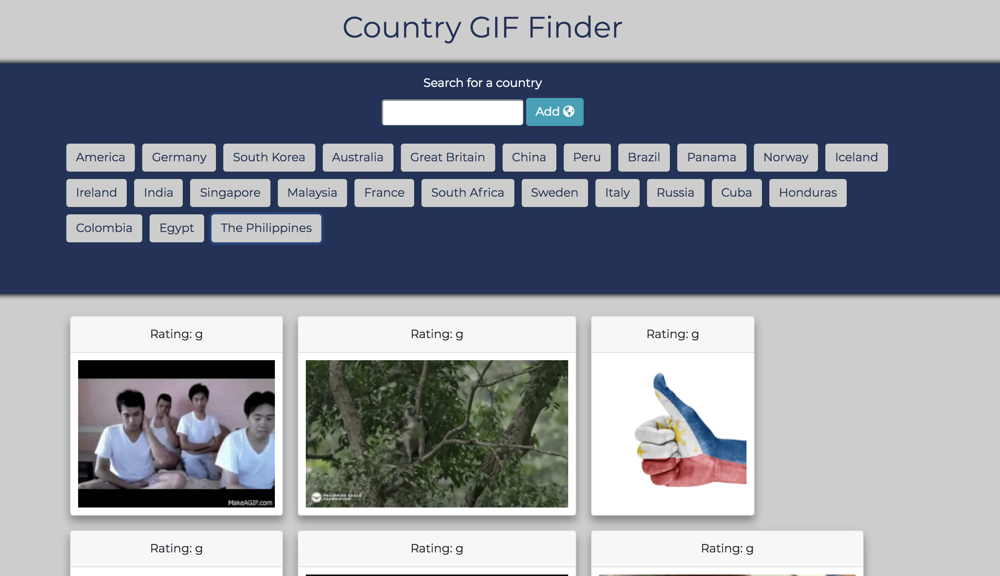

# GifTastic

This repo holds all the directories and files used in the making of my solution to the 6th homework assignment.

This webapp is a country themed GIF finder that uses the Giphy API.

 When the page loads, an array of buttons with the names of various countries populates the screen, and there is an input field for the user to add more buttons. When a button is clicked, the API is called and ten GIFs are rendered on the screen under the button section. Each GIF is paired with a rating (g, pg, pg-13, etc.) and are initialized as still images. When the user clicks on a GIF, the images src attribute is changed from the value that makes it still to the value that makes it animated. When the user clicks on an animated GIF, the src attribute is changed back to the value that makes the image still.

 Each time a button representing a country is clicked, the div element holding the current GIFs is cleared and ten GIFs for the selected country are loaded. This ensures that the user is only viewing GIFs from the country they selected.